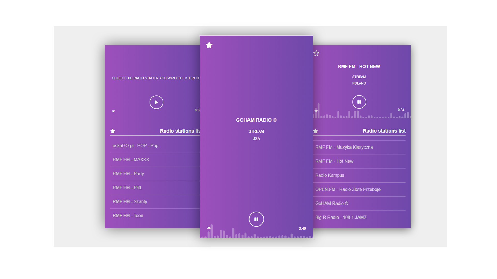

<h1>#Vue.js Internet Radio Component</h1>

This is internet radio streaming component.

<h1>#Usage</h1>

You can use it, like normal component. Copy components folder to your project folder and then import and register in your app.

<pre>
<code>
import player from '@/components/player.vue';

export default {

  name: 'app',

  components:{
    
    player,

  },

};
</code>
</pre>

